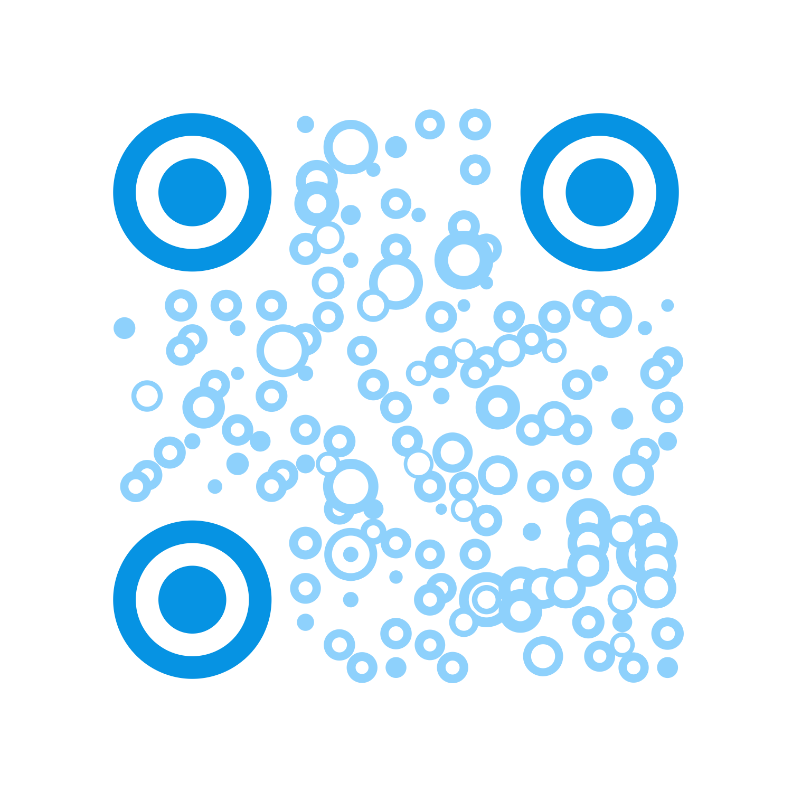
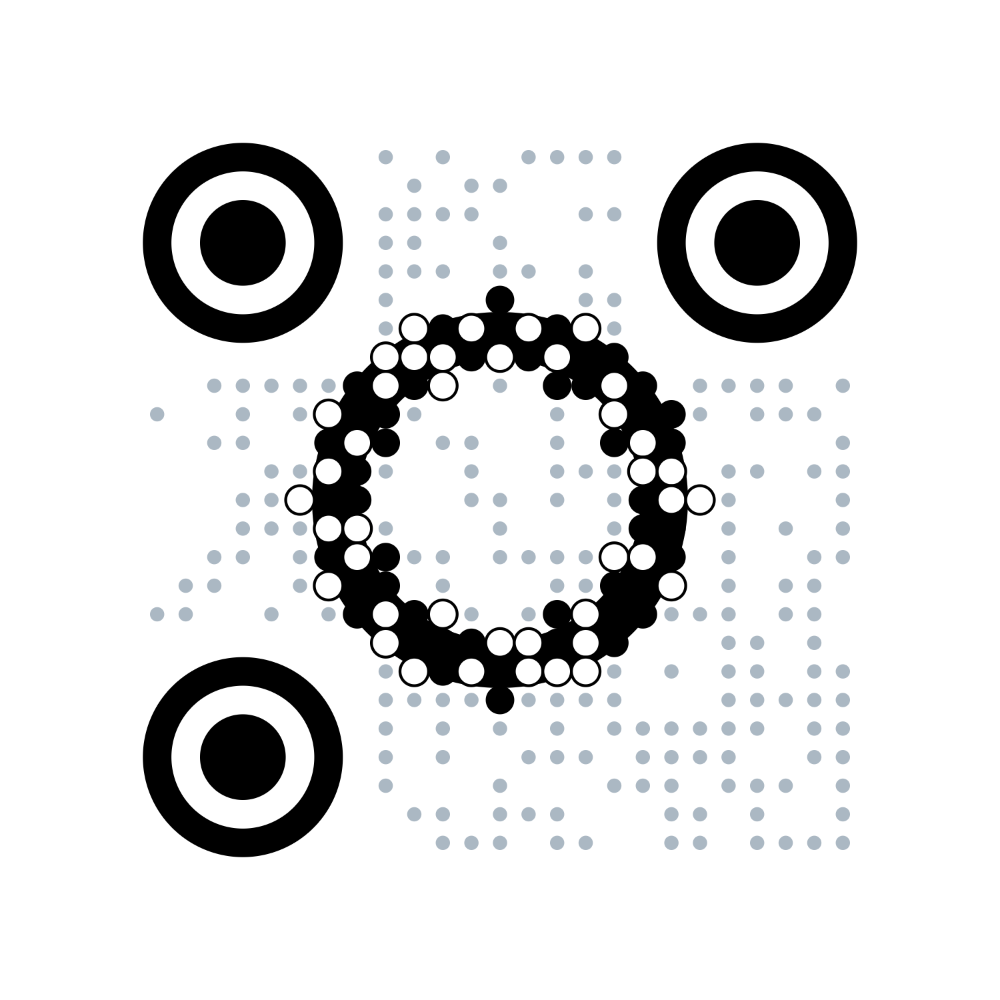

<p align='right'>
  <a href='./README_CN.md' target='_blank' hreflang='zh-cn'>简体中文</a>
</p>

# simple-qrbtf

Most of the code in this project comes from [ciaochaos/qrbtf](https://github.com/ciaochaos/qrbtf). Compared
with [ciaochaos/qrbtf](https://github.com/ciaochaos/qrbtf), it removes the framework limitation and supports the use
of `node` and `browser` in environments.

# preview

| base                                                     | circle                                                     | dsj                                                     |
| -------------------------------------------------------- | ---------------------------------------------------------- | ------------------------------------------------------- |
|  |  |  |

| func                                                    | image                                                     | imagefill                                                     |
| ------------------------------------------------------- | --------------------------------------------------------- | ------------------------------------------------------------- |
|  |  |  |

| line                                                     | rand-rect                                                    | solid(2.5D)                                               |
| -------------------------------------------------------- | ------------------------------------------------------------ | --------------------------------------------------------- |
|  |  |  |

# install

```bash
npm i simple-qrbtf
```

```bash
yarn add simple-qrbtf
```

```bash
pnpm add simple-qrbtf
```

# use

additional parameters can be found in the typescript type definition

es6

```javascript
import SimpleQr from 'simple-qrbtf';

console.log(SimpleQr.base());
```

node

```javascript
const SimpleQr = require('simple-qrbtf');

console.log(SimpleQr.base());
```
